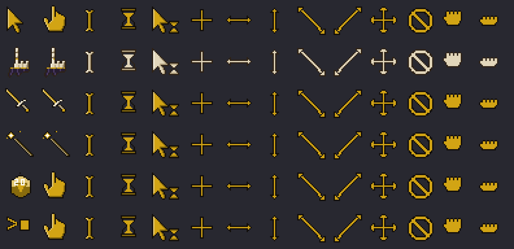

# OmCursor Forge

Forge retro pixel-art mouse cursors for [Omarchy](https://omarchy.org), right
from the bar. Pick a style — a classic pixel arrow, a **lich's skeletal hand
in a wizard-robe sleeve**, a sword, a wand, or any image of your own — and a
color that either follows your
Omarchy theme accent automatically or stays fixed to a custom hex. Cursor
Forge renders a real XCursor theme on the spot and applies it live to
Hyprland and GTK apps.



## What you get

- **Bar widget** showing a live preview of your current cursor. Click it to
  open the panel; scroll on it to cycle styles.
- **Theme-matched color**: when your Omarchy theme changes, the cursor is
  re-forged in the new accent automatically.
- **Custom color**: swatches or any `#rrggbb` hex.
- **The lich hand**: a hand-authored, retro pixel-art skeletal hand
  pointing its index finger — segmented phalanges, knuckle bones, and a
  theme-colored ring — rising out of a dark wizard-robe sleeve with a
  braided accent cuff and tattered cloth drooping off the wrist. At size
  48 it renders dedicated hi-res art with beveled curves, a sparkling
  ring gem, and hairline bone cracks.
- **Sword and Wand styles**: a theme-colored blade with a bone crossguard,
  and a wood wand with a sparkling accent star — because your cursor can be
  a fantasy artifact too.
- **Nerd styles**: a **D20** with a real 20 on its face (it glints and
  bobs), and a **Terminal** prompt whose block caret blinks.
- **Fourteen shapes**, one family: arrow, hand, text beam, wait, progress,
  crosshair, all four resize arrows, move, not-allowed, grab, and grabbing —
  with their common alias names, so apps rarely fall back to another theme.
- **Animated — and it moves**: the hand periodically taps its pointing
  finger (striking exactly at the hotspot), charges up and taps eagerly
  over links, the sword and wand bob, the wait hourglass drains, and rings and
  blades glint. Tune it with *Motion* and *Animated* toggles and a
  calm/normal/lively *Speed* control — or make everything static.
- **Click ripple**: an accent-colored ring (diamond, circle, or burst)
  bursts at the pointer on every left click — even over fullscreen games.
  Needs a one-time non-consuming mouse bind; the panel offers an
  **Install bind** button (nothing touches your config until you click it).
- **Left-handed mode**: mirrors the hand and arrow shapes and their
  hotspots.
- **Custom image style**: point it at any image file and it becomes your
  cursor, with a configurable hotspot and an optional theme tint that
  colorizes the image toward your accent (requires ImageMagick).
- **One verified rendering lane**: pure XCursor output, byte-verified
  complete at every size (24/48/72/96) — no second format to disagree
  about scaling.
- **Sizes** 24, 48, 72, and 96 px, pixel-perfect integer scales.
- **File-driven**: everything is stored in
  `~/.config/cursorforge/settings.json`. Edit it by hand and the change
  applies live.
- **Reversible**: "Restore system cursor" puts back whatever theme you had
  before the first apply.

## Install

```bash
omarchy plugin add https://github.com/ErikBurdett/omcursor-forge.git --enable
```

Then add the widget to your bar if it did not appear automatically:

```bash
omarchy plugin enable io.github.erikburdett.cursorforge right
```

OmEverything is driven from the panel — including the optional click-ripple
bind and the fractional-scaling fix, each behind its own button. OmCursor
Forge changes nothing until you click something in its panel: the
first apply is your consent, and the previous cursor theme is recorded so it
can be restored.

## Usage

- **Click** the bar widget to open the panel; pick a style, color, and size.
  Changes apply immediately.
- **Scroll** on the bar widget to cycle styles.
- **Edit the file**: `~/.config/cursorforge/settings.json` is watched;
  hand edits apply live. Keys: `style` (`classic` | `lich` | `sword` | `wand` | `d20` | `terminal` | `image`),
  `colorMode` (`theme` | `custom`), `customColor`, `size` (24/48/72/96),
  `imagePath`, `imageHotspot` (`"x,y"` on the 24px grid), `leftHanded`,
  `animated`, `motion`, `speed` (`calm` | `normal` | `lively`),
  `rippleShape` (`diamond` | `circle` | `burst`), `clickRipple`, `active`.
- **Script it** over the shell IPC:

  ```bash
  omarchy-shell io.github.erikburdett.cursorforge status
  omarchy-shell io.github.erikburdett.cursorforge setStyle lich
  omarchy-shell io.github.erikburdett.cursorforge setColor "#c05a4a"
  omarchy-shell io.github.erikburdett.cursorforge matchTheme
  omarchy-shell io.github.erikburdett.cursorforge cycle
  omarchy-shell io.github.erikburdett.cursorforge toggleLeftHanded
  omarchy-shell io.github.erikburdett.cursorforge setMode static   # or glints|full
  omarchy-shell io.github.erikburdett.cursorforge toggleAnimation
  omarchy-shell io.github.erikburdett.cursorforge toggleMotion
  omarchy-shell io.github.erikburdett.cursorforge setSpeed lively
  omarchy-shell io.github.erikburdett.cursorforge setRippleShape burst
  omarchy-shell io.github.erikburdett.cursorforge toggleClickRipple
  omarchy-shell io.github.erikburdett.cursorforge setImage /path/to/img.png
  omarchy-shell io.github.erikburdett.cursorforge setImageHotspot "3,1"
  omarchy-shell io.github.erikburdett.cursorforge toggleImageTint
  omarchy-shell io.github.erikburdett.cursorforge reset
  ```

## How it works

`cursorgen.py` (Python standard library only) renders the pixel-art shapes,
recolors them, and writes a standards-compliant XCursor theme to
`~/.local/share/icons/OmCursorForge` — fourteen shapes with their common
aliases, at 24/48/72/96 px with premultiplied alpha, correct hotspots, and
multi-frame animation where a shape animates. Anything else inherits from
Adwaita. Only XCursor output ships — it is the lane Hyprland animates and
the one this project byte-verifies at every size. It applies the theme
with `hyprctl setcursor` and GTK's
`org.gnome.desktop.interface cursor-theme`/`cursor-size` settings, and the
service re-asserts it when the shell starts, so it survives logins without
touching any Hyprland or GTK config files.

## Dependencies

- `python3` (required; part of a stock Omarchy install)
- `hyprctl` and `gsettings` (used when present; part of a stock install)
- ImageMagick `magick` (optional; only for the custom image style)

Nothing is downloaded or installed by the plugin at any point.

## Troubleshooting

**Cursor looks cropped / cut off?** Fractionally scaled monitors (for
example 1.25x) plus hardware cursor planes crop scaled cursor buffers on
some driver stacks. The panel detects the combination and shows a
**Fix scaling** button — it switches Hyprland to software cursors
immediately and persists that via a clearly marked, backed-up block in
`~/.config/hypr/looknfeel.lua`. The same fix is available from the plugin
folder as `./fix-fractional-cursor` (`remove` undoes it).

## Removal

Restore your previous cursor and remove the optional click-ripple bind (if
you installed it), then remove the plugin:

```bash
omarchy-shell io.github.erikburdett.cursorforge reset
~/.config/omarchy/plugins/io.github.erikburdett.cursorforge/uninstall-click-ripple
omarchy plugin remove io.github.erikburdett.cursorforge
```

Optional cleanup of everything OmCursor Forge ever wrote:

```bash
rm -rf ~/.local/share/icons/OmCursorForge ~/.config/cursorforge
```

## Development

```bash
python3 -m pytest tests/            # manifest contract + generator tests
python3 cursorgen.py preview --style lich --color '#6b8a69' \
  --scale 10 --dark --out /tmp/sheet.png   # art contact sheet
omarchy plugin validate .
```

## License

MIT — see [LICENSE](LICENSE).
